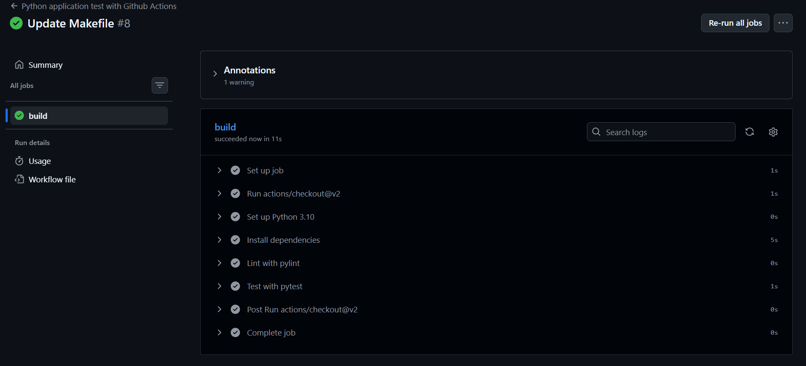
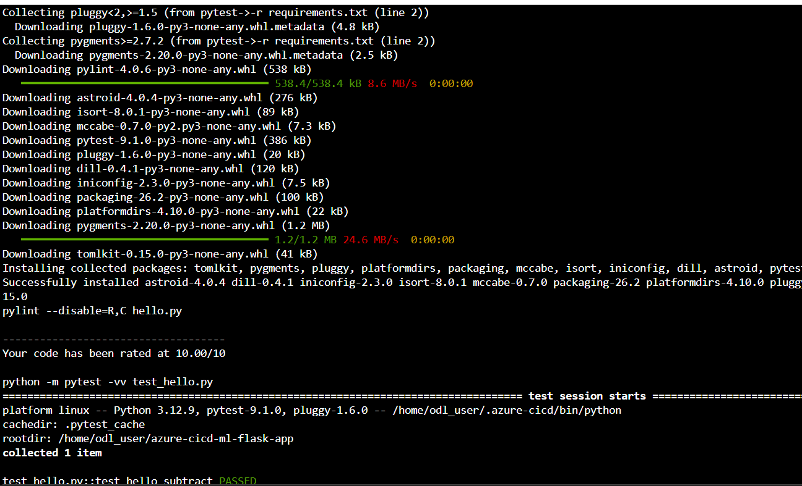
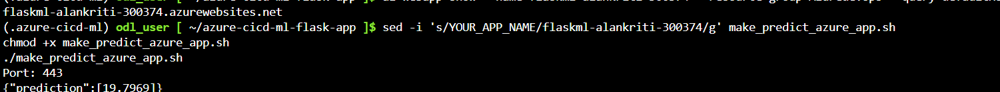
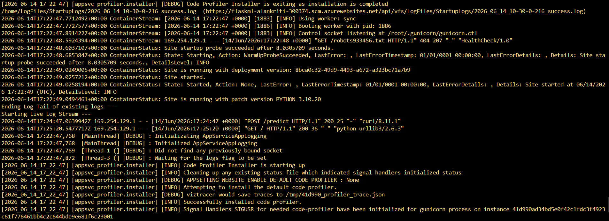
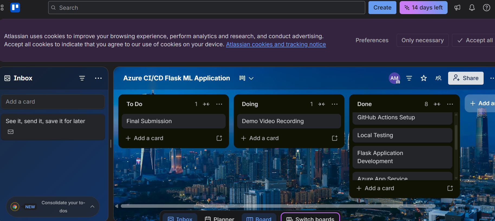

# Azure CI/CD Pipeline for a Flask Machine Learning Application

## Overview

This project demonstrates the implementation of Continuous Integration (CI) and Continuous Delivery (CD) using GitHub Actions, Azure App Service, Azure Cloud Shell, and Azure CLI.

A Flask-based Machine Learning application was deployed to Azure App Service. The application exposes a prediction endpoint that accepts housing feature data and returns a machine learning prediction in JSON format.

The project showcases automated testing, linting, deployment, monitoring, and cloud-based application management using Azure services.

---

## Technologies Used

* Python
* Flask
* GitHub Actions
* Azure Cloud Shell
* Azure App Service
* Azure CLI
* Pytest
* Pylint
* GitHub

---

## Project Objectives

* Build a Continuous Integration pipeline using GitHub Actions.
* Perform automated linting and testing.
* Deploy a Flask Machine Learning application to Azure App Service.
* Validate successful deployment through prediction requests.
* Monitor application logs using Azure Log Streaming.
* Demonstrate DevOps best practices for CI/CD workflows.

---

## Architecture Diagram

```text
Developer
    │
    ▼
GitHub Repository
    │
    ▼
GitHub Actions
(Lint + Test)
    │
    ▼
Azure App Service
(Continuous Delivery)
    │
    ▼
Flask Machine Learning API
    │
    ▼
Prediction Endpoint (/predict)
```

---

## Workflow

1. Code is pushed to GitHub.
2. GitHub Actions automatically runs linting and testing.
3. Successful builds are deployed to Azure App Service.
4. Azure hosts the Flask Machine Learning API.
5. Prediction requests are sent to the deployed endpoint.
6. Azure Log Streaming is used to monitor application activity.

---

## Project Plan

### Trello Board

## Trello Board
https://trello.com/invite/b/6a2eea35984e85e7b1c28e65/ATTIa8d8ef711224519d77c5d40ed3948580AAAF1462/azure-ci-cd-flask-ml-application
---
## Project Schedule
https://docs.google.com/spreadsheets/d/12L3rrz9GPI3AFN1WXdP5vDs-niGTTi8M2Ey31wGHn1A/edit?usp=sharing


### Estimated Timeline

| Week   | Deliverable                                | Difficulty |
| ------ | ------------------------------------------ | ---------- |
| Week 1 | Repository setup and project scaffolding   | Easy       |
| Week 2 | Continuous Integration with GitHub Actions | Medium     |
| Week 3 | Azure App Service deployment               | Medium     |
| Week 4 | Continuous Delivery and testing            | Medium     |
| Week 5 | Documentation, screenshots, and demo video | Easy       |

### Quarterly Goals

* Complete Azure DevOps CI/CD project.
* Improve cloud deployment skills.
* Gain experience with GitHub Actions.
* Build a portfolio-ready DevOps project.

### Yearly Goals

* Develop advanced Azure DevOps skills.
* Build production-ready CI/CD pipelines.
* Learn Infrastructure as Code tools.
* Strengthen Cloud Engineering and Data Engineering expertise.

---

## Instructions to Run the Project

### Clone the Repository

```bash
git clone https://github.com/alankritimehra/azure-cicd-ml-flask-app.git
cd azure-cicd-ml-flask-app
```

### Create Virtual Environment

```bash
python3 -m venv ~/.azure-cicd-ml
source ~/.azure-cicd-ml/bin/activate
```

### Install Dependencies

```bash
make install
```

### Run Tests

```bash
make test
```

### Run Linting

```bash
make lint
```

### Run All Checks

```bash
make all
```

### Deploy to Azure App Service

```bash
az webapp up \
--name flaskml-alankriti-300374 \
--resource-group Azuredevops \
--runtime "PYTHON:3.10" \
--sku F1
```

### Make Prediction

```bash
./make_predict_azure_app.sh
```

### View Logs

```bash
az webapp log tail \
--name flaskml-alankriti-300374 \
--resource-group Azuredevops
```

---

## Azure Web App URL

```text
http://flaskml-alankriti-300374.azurewebsites.net
```

---

## Screenshots

### GitHub Actions


### Cloud Shell Testing


### Prediction Output


### Log Streaming


### Trello Board


## Demo Video

YouTube Demo Link:

Add your YouTube video URL here after recording.

The demo video demonstrates:

* Azure Cloud Shell setup
* Local Continuous Integration
* GitHub Actions workflow
* Azure App Service deployment
* Successful prediction
* Azure log streaming

---

## Future Improvements

* Deploy using Azure Pipelines instead of Azure CLI deployment.
* Add a production-grade machine learning model.
* Containerize the application using Docker.
* Implement monitoring and alerting using Azure Monitor.
* Introduce Infrastructure as Code using Terraform.
* Add automated deployment approvals and rollback strategies.
* Integrate security and vulnerability scanning into the CI/CD pipeline.

---

## Author

**Alankriti Mehra**

MCA Student, PES University
BCA (AI & ML), Banasthali Vidyapith
Interested in Data Engineering, Cloud Computing, DevOps, and Generative AI.

